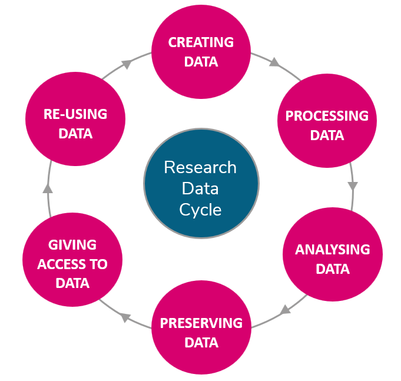
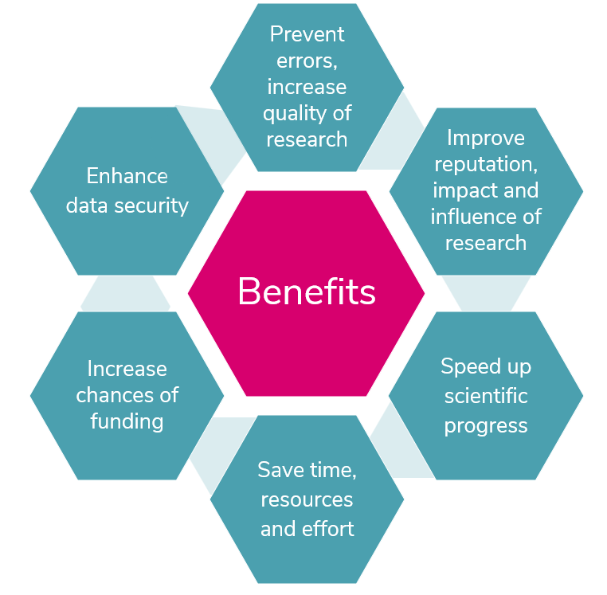
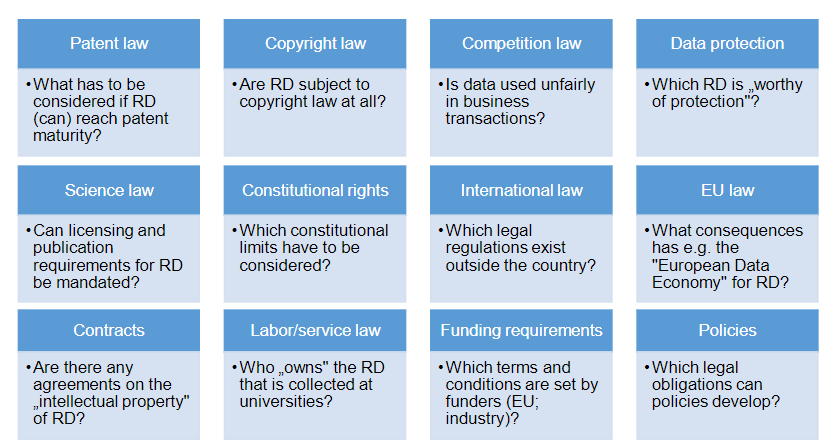
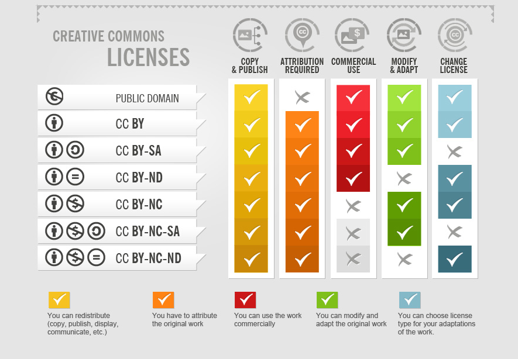
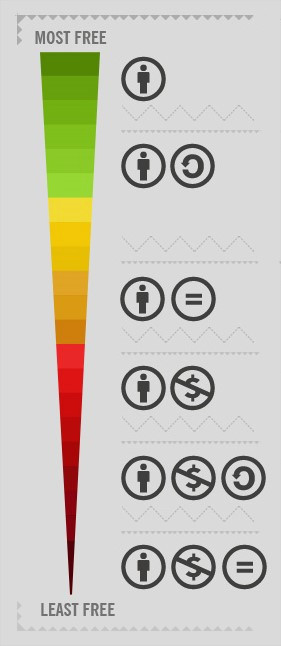
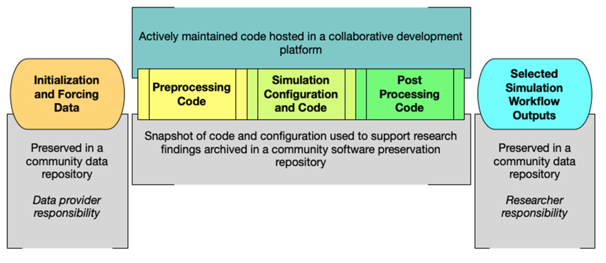
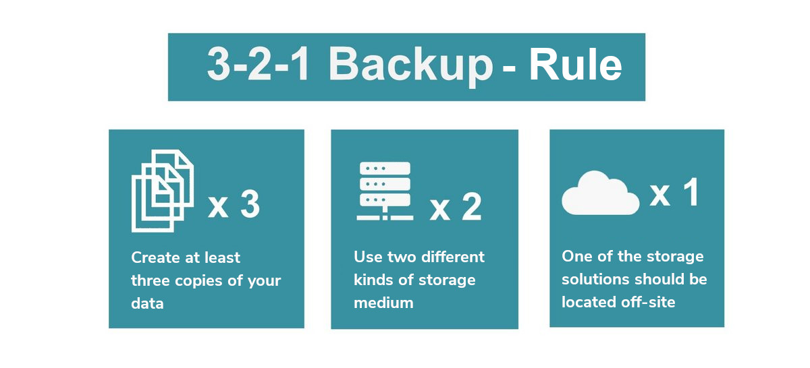

<!-- 
author:   C3L
email:    antje.ahrens@uol.de
Version:  1.0
language: en
license:  http://creativecommons.org/licenses/by/4.0/

mode:     Presentation|Slides|Textbook

narrator: US English Female

logo:   img/Background_2.png

icon:   img/efzn-logo.png

script: https://ajax.googleapis.com/ajax/libs/jquery/1.11.3/jquery.min.js
        https://cdn.jsdelivr.net/chartist.js/latest/chartist.min.js

link:   https://cdn.jsdelivr.net/chartist.js/latest/chartist.min.css

-->
[cc-by]: http://creativecommons.org/licenses/by/4.0/
[cc-by-image]: https://i.creativecommons.org/l/by/4.0/88x31.png

# Research Data Management

Welcome to "Research Data Management in the Energy Sector"! This course teaches all skills necessary to understand the principles and motivation behind Research Data Management (RDM) and enable you to implement RDM in your work and research group.

The course focuses on applicability in the energy sector.

<iframe src="https://wp.uni-oldenburg.de/innovative-hochschule-jade-oldenburg-wise20182019/wp-admin/admin-ajax.php?action=h5p_embed&id=19" width="660" height="1292" frameborder="0" allowfullscreen="allowfullscreen" title="Research Data Management in the Energy Sector"></iframe>

There are three possible ways to work with this course: 
1. Do you want to gain a thorough understanding of RDM? Follow the course outline described in the following graph. When you complete the course, you will have established a basic Data Management Plan for a project of your choice that you can build upon and adapt. 
2. Are you looking for a challenge? Answer the questions at the end of each chapter to find the solution to our RDM-puzzle.
3. Do you already have some knowledge of RDM? Great! Choose individual chapters that are of interest for your field of work by clicking on the plus-signs.

A quick word on the course format. The course is written in [Markdown](https://de.wikipedia.org/wiki/Markdown) and implemented in [LiaScript](https://liascript.github.io/). 
In the upper right corner, you can switch between textbook mode, presentation mode and slides. You may choose to have the course read aloud to you by clicking on the symbol on the bottom of the page in presentation mode. If you want to adapt the course for your own use, you may do so by going on [GitHub](https://github.com/FlourBerry/EFZN_RDM) and opening a branch of your own or downloading individual files. 

You can give feedback to this course on github: https://github.com/FlourBerry/EFZN_RDM/issues/2 

##  What is Research Data Management?

{{1}}
In early 2020, the COVID-19 disease, caused by the coronavirus SARS-CoV2, broke out globally, which led to the closure of many shops and businesses for quarantine reasons. The result, especially in the USA, was a large number of unemployed people who urgently needed money for their next rent payment, food or other expenses. As a consequence, the government decided to set up a relief package for anyone who registers as unemployed - but why didn't the money get to the people?

{{1}}
The reason for this was the overload of critical systems on which COBOL is still running. COBOL is a programming language that was developed in the late 1950s to control commercial applications. From today's perspective, the programming language is very outdated and no longer taught in the training of programmers. That is why there was no personnel to take care of the systems when they collapsed. Unfortunately, many applications with the outdated programming language are still running in the business sector. 

{{1}}
Source: [FDM Thüringen: Scarytales, Licensed under CC-BY 4.0](https://forschungsdaten-thueringen.de/fdm-scarytales/articles/ueberblick.html)

{{2}}
>__Exercise:__ Suggest two possible process changes that could have prevented the outcome of the scenario:

{{2}}

 Solution (click to enlarge):

> There are several solutions possible: Existing systems should be questioned, since requirements can change and established habits can lead to problems from today's perspective. For example, at some point data might no longer be able to be called up or might exist in formats that are increasingly difficult to be processed. A thorough documentation of the programs might also help in some cases to rebuild them in other languages. For timely relief, the administration called out to retired COBOL programmers to work on the issues.

{{3}}
While maybe not as critical for society at large, scientists can face similar problem when trying to access old data or programs that were written for other purposes but are know needed for the current tasks: Data are insufficiently labeled, have been overwritten, commercial computer programs have been discontinued or process details have not been recorded.

{{3}}
**Research Data Management (RDM)**  aims to break this dynamic by ensuring a sustainable and coherent strategy for all data types throughout the research process, enabling researchers to store, access and re-use their own work effectively and safely and opening their findings worldwide to improve on cross-disciplinary collaboration, monitoring and replication.

{{3}}
RDM includes all activities associated with processing, storage, preserving and publication of research data.

---

__The Research Data Lifecycle__

*Figure 1:* The Research Data Lifecycle. Original source: [UK Data Service](https://ukdataservice.ac.uk/learning-hub/research-data-management/), recreated by A. Ahrens. Licensed under [CC-BY-4.0](https://creativecommons.org/licenses/by/4.0/deed.de)

<!-- --{{1}}--
The "Research Data Lifecycle" describes a cyclic process of data generation and management. First, data is created, then processed. The next step is analyzing data, followed by preserving the results. Now, it is time to give access to the data. Ideally, the cycle closes at this point: Data is being re-used and new, well-documented data is being created.
-->

{{2}}
>**Exercise**: 
> Look at each step of the cycle with your data in mind: 
>
> - Which steps do you actively apply in your research process?
>
> -  Which tools or software do you use at each step? 
>
>
> - How well is the data protected against data loss? Where are possible flaws where data or information could get lost?
>
> - Does the cycle "close"? Which repositories or platforms do you use to store your results?

## Benefits of RDM

<iframe src="https://www.twillo.de/edu-sharing/eduservlet/render?node_id=e7272cc1-7e1a-409b-aff4-feb578a988a8&amp;version=1.3" title="Prof. Dr.-Ing. Astrid Niesse on RDM" width="800" height="500" frameborder="0" allow="accelerometer; autoplay; encrypted-media; gyroscope; picture-in-picture"></iframe>

You…

-	have a lack of extra time to devote to RDM?

-	don´t have enough money for structured RDM?

-	don´t have the expertise, resources, or incentives to share your data? 

-	worry whether your data is transferable because some data have ethical or epistemological restrictions?

-	have many stakeholders with competing interests in your project?

In this chapter, we will prove to you that RDM is not as tricky as you think.

---

__Benefits of RDM in your projects__

*Figure 2:* "Benefits of Research Data Management" by N. Seitz. Licensed under [Attribution 4.0 International (CC BY 4.0)](https://creativecommons.org/licenses/by/4.0/deed.en).

If done right, RDM will

__... Save time, resources, effort and money:__

-	preserve time that is otherwise lost while searching for, recovering, and deciphering data

-	make data reusable

-	enable you to benefit from high quality datasets from other researchers

__... Improve impact and speed up scientific progress:__

-	make research reproducible and reusable, so others can verify and build upon your findings. This strengthens __integrity__ and increases your citations.

-	improve your research reputation and increase your __visibility__

-	continually influence research developments long after the original research has been completed

-	will permit new and innovative research to be built on existing information, especially within and across disciplines.

__... Help to prevent error and enhance data security:__

-	secure your data against loss and protect sensitive data against misuse, theft, damage and disaster.

-	ensure records are synchronized, complete and reliable.

-	improve research workflows to make them more resilient to human error and software vulnerability

__... Show compliance with research obligations of your institution and funder:__

-	fulfill grant requirements and comply with practices conducted in industry and commerce in order to demonstrate a high-quality research output.

-	ensure transparency since individual contributions are documented on-the-fly throughout the complete research and archiving process.

-	increase your chances of funding since many funding organizations require a DMP.

-	simplify cooperation and collaboration (e.g. through better documentation and affiliation of the data collected).

<iframe src="https://www.twillo.de/edu-sharing/eduservlet/render?node_id=41f2f7c1-4c08-47ea-ad2c-ab63dd4e64e7&amp;version=1.12" title="Henrik Wagner on Research Data Management" width="800" height="500" frameborder="0" allow="accelerometer; autoplay; encrypted-media; gyroscope; picture-in-picture"></iframe>

##  Open Science and RDM

Open Science strives to to make scientific research and its dissemination **accessible to all levels of society**. It encompasses practices such as publishing open research, campaigning for open access, encouraging scientists to practice **open-notebook science** (such as openly sharing data and code), broader dissemination and engagement in science and generally making it easier to publish, access and communicate scientific knowledge. 

Source: https://www.helmholtz.de/en/about-us/our-values/open-science/

> **Research Question**:
> 
>Is there an Open Science or Research Data Policy at your institution?
> 
> What is its scope? What is regulated and how?
>
> If not: 
> Would you like to have a Research Data Policy?
> What content should it have?

__Make it FAIR__

The main idea behind the FAIR principles is:__As open as possible, as closed as necessary!__  The acronym stands for

- Findable
- Accessible
- Interoperable
- Re-Usable

{{1}}
> **Exercise**: Look closely at the graph to identify which measures especially apply to your area of work and data types you are using.

*Figure 3:* "Fair Guiding Principles" by A. Ahrens. Licensed under [Attribution 4.0 International (CC BY 4.0)](https://creativecommons.org/licenses/by/4.0/deed.en).

<!-- --{{1}}--
As open as possible, as closed as necessary. This is the main idea behind the FAIR principles. The acronym stands for: Findable, Accessible, Interoperable and Re-Usable.

In Detail, that means:
1. To make data findable, you should assign unique and persistent identifiers, that stay active. Also, provide extensive and useful metadata - for example, avoid acronyms. You should also use common repositories. You can find a list on Re3data.com. For the energy sector, we recommend the Open Energy Platform.
2. Accessible data use stanrdized communications protocol such as HTTP or FTP. Make sure anyone with a computer and internet connection can access at least the metadata. Your data and metadata should be long-term accessible. For sensitive data, you may use authentification routines.
3. In order to achieve interoperability, use a formal, accessible, shared and boradly applicable language. Also, use tools and software that are FAIR themselves. Cross-reference your data and metadata.
4. Re-usable data is described by as much information as possible, such as process details. Clearly describe data usage licenses. Be transparent about data provenance and know and meet your own community's data standards.
-->

{{2}}
> **Quiz**: What can you do to make your data FAIRer?    
>
> [[X]] use Creative-Commons or GNU Licenses
> [[ ]] keep processing details undisclosed
> [[ ]] ensure access security 
> [[X]] create detailed Metadata    
> [[X]] ensure long-term accessibility in repositories

##  Data Management Plan

The **Data Management Plan (DMP)** contains all information that describes and documents sufficiently the collection, processing, storage, archiving and publication of research data within a research project.  

>**Exercise**: Watch the following video and answer the questions.

<iframe src="https://www.twillo.de/edu-sharing/eduservlet/render?node_id=fb5ac006-a355-41e5-bbaa-32a3ebd4e019&amp;version=1.3" title="Data Management Plan - Interactive Video" width="800" height="500" frameborder="0" allow="accelerometer; autoplay; encrypted-media; gyroscope; picture-in-picture"></iframe>

Many public funding organizations require a DMP prior to granting funds for research projects, thus making DMPs an integral part of the scientific process, especially in data-intensive research fields such as the energy sector.

| Funder | Plan demanded? | Content | Updates? |
|:-------|:--------------------------|:--------|:---------------|
|Horizon Europe| Data Management Plan|see [Horizon Europe Online Manual](https://op.europa.eu/en/web/eu-law-and-publications/publication-detail/-/publication/9570017e-cd82-11eb-ac72-01aa75ed71a1)|Yes|
|[German Research Foundation (DFG)](https://www.dfg.de)     |Information on the handling of research data|[DFG Guidelines on the Handling of Research Data](https://www.dfg.de/en/research_funding/principles_dfg_funding/research_data/), Checklist|No|
|[German Ministry for Economic Affairs and Climate Action (BMWK)](https://www.bmwk.de/)| Research Data Exploitation Plan|scientific and economic potential, connectivity and transferability|once a year|
|[German Ministry of Education and Research (BMBF)](https://www.bmbf.de/bmbf/de/forschung/digitale-wirtschaft-und-gesellschaft/aktionsplan-forschungsdaten/aktionsplan-forschungsdaten_node.html)   |Plan sometimes required|Content depends on the respective programme||
|[German Ministry for Digital and Transport (BMDV)](https://bmdv.bund.de)|Research Data Exploitation Plan sometimes required |Content depends on the respective programme||

##  Tools

Tools can help you
-	to comply with data management requirements by providing guidance and templates for data management planning. They facilitate data sharing and preservation.

-	to organize, analyze, and visualize your data in order to  make it easier to draw insights and conclusions from your research. Many research projects generate large and complex datasets that can be difficult to manage without the right tools.

-	to facilitate collaboration by allowing multiple researchers to access and analyze data.

-	to ensure accuracy and reliability of your data by providing features such as data validation, version control and audit trails

-	to long-term preserve your data with backups, archives, and structured metadata.

__How?__ 
The specific features and capabilities of research data management tools can vary widely depending on the tool and the intended use case.
In general there are 6 steps:
1.	Choose the right tool
2.	Plan your data management strategy
3.	Set up the tool
4.	Input and manage your data
5.	Collaborate and share your data
6.	Preserve and archive your data

There is a wide range of tools for RDM, for example:

Tools for internal DM:
-	https://www.coscine.de/
-	https://www.indiscale.com/

Tools to share and register your research data:

- https://zenodo.org/
- https://openenergy-platform.org/

Data Management Plan Tools:

-	[RDMO](https://rdmorganiser.github.io/en/)
-	[DMPOnline](https://dmponline.dcc.ac.uk/)
-	[DMPTooI](https://dmptool.org/)

You can also create a DMP in a simple Excel-Sheet.
In the tools above, you can choose a set of questions that you want to have included in your DMP. If you want to take a look at an example DMP, you can look [here](https://cloud.uol.de/f/7510018536).
We recommend to use RDMO or DMPOnline due tu their broad spectrum of available questionnaires.

> **DMP Task**:
> 
> Now it is time to start your DMP! Choose a **tool** and a set of **questions** that you want to work with and enter your basic project parameters:
>1. Title and Research Question
>2. Project Partners and Institutions
>
>Depending on your settings, you can add other details required by the respective questionnaire. 

Congratulations! You have started your first DMP!

---

__It`s Quiz Time!__

<iframe src="https://wp.uni-oldenburg.de/innovative-hochschule-jade-oldenburg-wise20182019/wp-admin/admin-ajax.php?action=h5p_embed&id=20" width="800" height="600" frameborder="0" allowfullscreen="allowfullscreen" title="Tools Quiz"></iframe>

## Legal Aspects
Because research projects have very diverse legal requirements, consider the following areas and their relevance to your project.

*Figure 4:* Relevant Legal Areas. Source: Biernacka et al. 2020. Licensed under [Attribution 4.0 International (CC BY 4.0)](https://creativecommons.org/licenses/by/4.0/deed.en).

> __Exercise:__
>
> Which legal questions do you need to clarify with your funder or institution?

__Licenses__

The internet has made it incredibly easy for people to share and collaborate. However, copyright laws can often pose obstacles to this process. Generally, others cannot use or remix your work without obtaining your permission first.
But what if you want to encourage others to reuse your work? In such cases, you may consider publishing your work under a [Creative Commons](https://creativecommons.org/) or [GNU General Public license](https://www.gnu.org/licenses/). 

Creative Commons licenses are a set of copyright licenses that allow creators to grant others permission to use their work. These licenses are designed to be easily understood and applied, providing a flexible framework for sharing and collaboration. By assigning a Creative Commons license, researchers can clearly communicate how others can use, distribute, modify, and build upon their work.

For software, you may also use a [GNU General Public License](https://www.gnu.org/licenses/gpl-3.0.html), guaranteeing end users the four freedoms to run, study, share, and modify the software. For other options to license software, you can consult [this Wikipedia comparison](https://en.wikipedia.org/wiki/Comparison_of_free_and_open-source_software_licenses). 

So "free" licenses provide you with the flexibility to choose which rights you wish to retain and allow you to clearly communicate to others how they can use your work. This way, you can strike a balance between protecting your rights as author and fostering a culture of sharing and collaboration on the internet.

__Step 1: Selecting License Features__ 

First, you need to choose the specific conditions that you want to apply to your work.

Here are the "building blocks" to consider:
1.	__Attribution (BY):__ requires to give attribution to the creator.  

2.	__ShareAlike (SA):__ If others use your work, they are required to share it under the same conditions that you specified.

3.	__NoDerivatives (ND):__ This license allows reusers to copy and distribute the material in unadapted form only.

4.	__NonCommercial (NC):__ This feature allows the reuse of your work only for non-commercial purposes.

These features can now be combined to make the license of your choice:

*Figure 5:* Foter.com (2015): CC License Requirements. Cropped by A. Ahrens. Licensed under [Attribution 4.0 International (CC BY 4.0)](https://creativecommons.org/licenses/by/4.0/deed.en).

You may also choose to give your work to the Public Domain and resign all rights you have by assigning "CC0".

__Step 2: Obtaining a License__

When giving attribution to a Creative Commons-licensed work, it's important to follow certain guidelines. A useful mnemonic to remember is __TASL__, which represents the key elements to include:
1.	Title: Include the name of the material if it has been provided. This helps to identify the specific work you are attributing.
2.	Author: Clearly state the name of the person or entity that owns the material. This gives credit to the original creator of the work.
3.	Source: Mention where you found the material. Provide the URL or hyperlink that directs others to the location where the work is hosted. This allows others to easily access the original source.
4.	License: Specify the specific Creative Commons license that applies to the work. Simply saying "Creative Commons" is not sufficient. Name the CC license and provide a direct link to the license text. This informs others of the rights and permissions granted by the license.

A final word on "openness": you might be tempted to protect as many of your rights as possible. Try to think the other way around, though: how open can you make your data? For example, a researcher from a commercial institution might be prohibited to use your data because of its NC-license or someone else might be forced to reproduce datasets because they are licensed under CC-BY-ND.

*Figure 6:* Foter.com (2015): Degrees of Freedom. Cropped by A. Ahrens. Licensed under [Attribution 4.0 International (CC BY 4.0)](https://creativecommons.org/licenses/by/4.0/deed.en).

<iframe src="https://wp.uni-oldenburg.de/innovative-hochschule-jade-oldenburg-wise20182019/wp-admin/admin-ajax.php?action=h5p_embed&id=21" width="800" height="564" frameborder="0" allowfullscreen="allowfullscreen" title="Licensing"></iframe>

__Access Rights__

If you want to limit access to the published data, this does not contradict the FAIR guidelines, but you should make the access scheme transparent (e.g. by using appropriate licenses) and give access to as much detail as possible. 

Try to assign roles to all collaborators. Each role is associated with a set of access rights that are necessary to carry out the duties and tasks associated with that role. 
The following principles are typically followed:

1.	__Principle of least privilege:__ Individuals should be granted the minimum access rights necessary to perform their job functions effectively. Assigning excessive privileges increases the risk of unauthorized access or misuse of data. 

2.	__Role-based access control (RBAC):__ Assign roles to individuals and associating access rights with those roles. This simplifies the management of access rights as permissions are granted to roles rather than to individual users. Role assignment is based on the individual's job responsibilities, ensuring that access rights are aligned with their needs.

3.	__Regular review and updates:__ Access rights and role assignments should be periodically reviewed and updated to reflect changes in job roles, responsibilities, or organizational structure. 

__It's Quiz Time!__
1. What are some aspects of access security?

[[x]] Privacy, integrity, availability, and controllability 
[[]] Authentication, encryption, authorization, and auditing 
[[]] Authentication, vulnerability assessment, encryption, and monitoring 
[[]] Privacy, vulnerability assessment, authorization, and auditing

2.	What is a recommended practice for password protection? 

[[]] Use sequential characters on the keyboard for easy memorization 
[[]] Use dictionary words to make passwords more secure
[[x]] Use strong passwords with at least eight characters, including upper and lower case letters, special characters, and numbers
[[]] Avoid using special characters and numbers in passwords

3.	What is the purpose of access rights and role assignment? 

[[x]] To limit access to sensitive data to authorized individuals only 
[[]] To increase data availability for all users 
[[]] To delegate data backup responsibilities to multiple individuals 
[[]] To restrict data access based on file formats

__Data Types__

Depending on your field of expertise, there will be different data types relevant to your work. In your DMP, you can specify individual datasets and name their identifiers, file size, origin and so forth.

Simulations and software programmes are a special case. Here, not only the resulting datasets are of scientific value but also the programmes, algorithms and settings leading up to the data.

The data types you choose to publish have consequences for your Research Data Management in regard to the "Accessible", "Interoperable" and "Re-Usable" Criteria of the FAIR Guidelines.

**1. Accessible**  

--> Make sure that (meta)data are long-term accessible

The amount of memory space needed for long-term, save storage may vary greatly between data types. For example, if your reasearch data consist  of high-resolution images of potential wind turbine sites, memory space needed for backup and repositories will be much higher than a handful .csv files with projected power loads.

**2. Interoperable**

--> Use tools and software that are FAIR themselves

Try to remember the idea of "as open as possible, as closed as necessary.": Strive to choose, where possible, programs and data types that are open and FAIR. For example, do not describe your processing details in a .pdf file, but rather use a .txt-file that can be read and edited with various programs.

**3. Re-Usable**

--> know and meet community standards

As the expert in your own field, you are the one to decide here: which data types are most likely to be found, easily re-used and shared in your scientific community? If these are "closed", you could provide two files: one that adheres to the common standards and a more open alternative that promotes the idea of open science. 

> **Exercise:**
> 
> Make a list of the data types commonly used in your working group and their "FAIR value". Use the criteria in the table below.

| FAIR value|	Machine Readability	| Human Readability	| Long-time Stability|	Metadata   | Example|
| :--------- | :---------| :--------- | :--------- | :---------|:-----------|
|very good |with common open software	|yes and without special software	|normed standard	|completely preserved |  .csv|
|good	|with common and well-documented software	| compressed with standard procedures, but practically yes	|longterm or widely established	| technical details are provided| .xlsx|
|moderate	| proprietary standard format   | with open software (reliably?) convertible to higher class| 	relatively new format	| some important ones (e.g. units) are included | MATLAB file|
|bad	| self-developed reading software| no|	newly developed	| no information    | |

Source: translated and adapted from [forschungsdaten.info](https://forschungsdaten.info/themen/veroeffentlichen-und-archivieren/formate-erhalten/), [CC-BY 4.0](https://creativecommons.org/licenses/by/4.0/deed.en)

>**DMP Task**: 
>
> If you already know datasets that you will be (re-)using or producing, enter them in your DMP as thoroughly as you can at this point. 
>
> If you do not know your datasets yet, enter one or two "dummy" datasets and follow the respective questionnaire to get an idea of the amount of detail required in the DMP.

---

__Software__

Research programmes and simulation software are essential in energy research. Some researchers are very reluctant in sharing this part of their research work, sometimes because of economic considerations. 

The German Research Alliance (DFG) adresses software development in a research context in its [Guidelines for Safeguarding Good Research Practice](https://www.dfg.de/en/research_funding/principles_dfg_funding/good_scientific_practice/index.html), stating that "software programmed by researchers is made publicly available along with the source code". The source code must be persistent, citable and documented. Certain individual exceptions are possible, though.

So, whether you plan to publish some, all or none of your self-developed software, you have to document well, plan ahead and ensure a good access strategy in your development team.

- Versioning
  
  Various cloud programming platforms such as [GitLab](https://about.gitlab.com/de-de/) ensure a consistent preservation of all of your software versions, make contributions transparent and simplify collaboration.

- Documentation

  Programmes should be documented and commented, e.g. by stating origin, purpose and scope of a programme, limitations of variables and ideally a short manual.

- Publication

  With journal publication of an article, corresponding software should be cited with version number and a persistent identifier such as a DOI. Choose a software archive with version control. Sometimes, timely open access is not possible. In this case, at least the algorithm used must be outlined completely. If the source code is not published, state the reason and potentially the time period until release.

---

  __Simulation__

With regard to simulation, we are presented with some additional challenges. 

The longevity of simulation outputs is harder to assess than of observational data. In a 2021 paper on Open Science in Earth System Modelling, [Mullendore et. al. (2021)](https://doi.org/10.3389/fclim.2021.763420) indentify the following problems:
- Simulations can generate massive output 
- Interdependencies between hardware and software can limit the portability of models and make the longterm accessibility of their output problematic. Models in many cases involve
interconnections between community models, open source
software components, and custom code written to investigate
particular scientific questions. 
- A lack of standardization and documentation for
models and their output makes it difficult to achieve the goals
of open and FAIR data initiatives

The following strategies may be applied when working with simulations: 
- Analyze your project: does it focus on **knowledge** or **data production**? "Most scientific research projects are undertaken with the main goal of knowledge production (e.g., running an experiment with the goal of publishing research findings). Other projects are designed and undertaken with the specific goal of data production, that is, they produce data with the intention that those data will be used by others to support knowledge production research." [(Mullendore et. al. (2021))](https://doi.org/10.3389/fclim.2021.763420)
-  Publish all elements relevant to the simulation, not just source code (see [Figure 3](#3)). 
- Publish enough output data to evaluate and re-use your findings, but not all simulation runs
- Some software may be released openly while others remain restricted due to security or proprietary concerns. In this case, the documentation should provide enough information to reproduce the process.

*Figure 7:* [Mullendore et. al. (2021)](https://doi.org/10.3389/fclim.2021.763420): Data and software elements to be preserved and shared by all projects.

__Checklist for FDM in simulation and software development:__

[[x]] Train yourself and your team in software development quality
[[x]] State the purpose of each programme in a few words
[[x]] Keep your software up to date with quality management
[[x]] Keep the intention of every function clear (by naming or comments) 
[[x]] Choose an appropriate license
[[x]] Establish quality management in your simulation process

>**DMP Task**: 
>
> If you have self-developed programmes in your project, enter them as a separate dataset in your DMP, name all contributors and the purpose of each programme.

##  Infrastructure
--{{0}}--
In this chapter, we will discuss how to handle your research data files both in handling and storage.

{{0-1}}
!?[NFDI 2023](https://www.youtube.com/watch?v=uJ01g9m8uE4 "Nationale Forschungsdaten Infrastruktur (NFDI)")

{{0-1}}
Source: Nationale Forschungsdaten Infrastruktur (NFDI) (2023): Available at: https://www.youtube.com/watch?v=uJ01g9m8uE4. Licensed under [Attribution 4.0 International (CC BY 4.0)](https://creativecommons.org/licenses/by/4.0/deed.en)

{{1}}
__Back-Up and Archiving__ 

{{1-2}}
Backup needs to be prepared by well-structured and named data. When naming files and folders, you should adhere to the following standards:

{{1-2}}
- Give comprehensive names 
- Use uniform schemes 
- Develop logical structure 
- Include Date in the following form: YYYYMMDD 
- Avoid spaces and special characters 

{{1-2}}
| DO   | DON'T   |
| :--------- | :--------- |
| 20230312_h2oSample1      | BDD extract_edited colored.jpg |
| 20230315_location5_processed     | original.jpg|
| 2018_weatherlogfiles     | table1_john(copy)  |

--{{1}}--
You should develop a back-up policy early on in your project, since later down the road it is very hard to re-structure established processes. 

{{1-2}}
A handy rule is the 3-2-1 rule: 

{{1-2}}

{{1-2}}
*Figure 8:* [I. Lang/Bearbeitung E. Böker](https://forschungsdaten.info/themen/speichern-und-rechnen/datensicherheit-und-backup/): 3-2-1 Backupregel. Edited by A. Ahrens: Translation. Licensed under [CC-BY 4.0](https://creativecommons.org/licenses/by/4.0/deed.en)

--{{1}}--
The 3 2 1 rule states that you are to create at least three copies of your data, secure them on two different kinds of storage medium and make sure that one of those mediums is located off-site. This way, your data is protected from natural disaster, which will most likely only hit one location at a time, against accidental deletion and against deterioration of one kind of storage medium. For example, CDs have quite a long lifespan but CD drives as a reading device have become increasingly scarce.

{{1-2}}
> __Exercise__:
>
> Which backup solutions does your institution offer? If they do not meet your requirements, calculate additional costs in order to include them in your project proposal.

{{2-3}}
__Archiving__

{{2-3}}
Archiving refers to the process of creating backups of selected data and storing it for long-term retention. It involves preserving important information, such as __final__ versions of documents or records, in a secure and accessible manner. 

{{2-3}}
When archiving data, it is crucial to ensure its integrity. This means that the data remains unchanged and tamper-proof during the archival process and throughout its storage. Techniques such as checksums or digital signatures can be used to verify the integrity of archived data, providing assurance that it has not been altered or corrupted. An essential aspect of archiving is the ability to search and retrieve archived data efficiently. Implementing effective indexing, metadata tagging, and search capabilities enables users to locate and retrieve the required data without having to sift through vast amounts of archived content manually.

{{2-3}}
There are various commercial providers for back-up and archiving solutions. Consider the following questions before choosing one:
{{2-3}}
- Does it carry a seal for trustworthy long-term archives (e.g. CoreTrustSeal, nestor seal, DIN 31644)?
- Does it fulfill your technical requirements?
- Can you cover the expenses?
- Is the data readily available to you?
- Does the service provider guarantee long-term storage?

{{3}}
__It's Quiz Time__

{{3}}
1. What are some risks that can lead to data loss?
{{3}}
[[x]] Technical defects, catastrophes, theft, oblivion
[[x]] Software updates, power outages, human error and viruses 
[[x]] Natural disasters, software malfunctions, hardware upgrades
[[x]] Data corruption, cyber attacks, accidental deletion, system crashes

{{3}}
2. Which of the following is NOT a atretegy for data protection?
[[ ]] Storage on university servers with automatic regular backup
[[ ]] Backup of important files in a t least three copies on spatially separated storage media.
[[ ]] Regularly backing up data and testing data recovery
[[x]] deleting unnecessary files to save storage space

{{3}}
3.	What are some physical protection measures for data? 
[[ ]] FileVault, Bitlocker, dm-crypt
[[ ]] Password protection, two-factor authentication, role assignment 
[[x]] Lockable rooms, safes, data trustees 
[[ ]] Regular data backups, firewall protection, antivirus software

{{3}}
4.	Why is secure data handling important?
[[x]] To prevent accidental data deletion 
[[x]] To protect against data theft and misuse 
[[ ]] To increase data storage capacity 
[[ ]] To improve system performance and speed

{{3}}
5. What is the recommended strategy for backup?
[[ ]] At least two copies of a file on two different media, one of which is decentralized 
[[ ]] At least three copies of a file on three different media, one of which is decentralized 
[[x]] At least three copies of a file on two different media, one of which is decentralized 
[[ ]] At least two copies of a file on three different media, one of which is decentralized 

{{3}}
6.	What is the difference between backup and archiving?
[[ ]]Backup is the storage of selected data for long-term storage, while archiving is the automatic backup of all data. 
[[ ]]Backup involves making multiple copies of data, while archiving involves storing final versions only. 
[[ ]] Backup is the protection against data theft, while archiving is the prevention of data misuse. 
[[x]] Backup is the (semi)automatic backup of all data, while archiving is the backup of selected data for long-term storage.

## Metadata

Well-structured metadata are of high value for re-users. Therefore, all four of the FAIR criteria stress their importance.

Metadata in research contain structural information on research results such as datasets or code. 

There are different types of metadata with varying functions:

> __Exercise:__
> 
> Enter the correct term for each metadata type.
>
> __descriptive  - administrative - bibliographic - process__

| Type                    | Content    | Function   |
| :---------------------- | :--------- | :--------- |
| [[bibliographic]] metadata  | title, author, description, keywords    | make data findable and thematically fitting |
| [[administrative]] metadata | data types, location, access rights, licenses     | administration, long-term preservation  |
| [[process]] metadata        | methods, tools, analysis steps    | reproducability, traceability    |
| [[descriptive]] metadata    | additional information on content, scope and data genesis    | close information gaps     |

Bibliographic and administrative metadata can be standardized cross-disciplinary, while information on process details or content are often structured and described in a way highly specific to the respective field. Nevertheless, they are often crucial for findability and traceability of research data. Therefore, some disciplines have developed their own metadata standards.

---

__Choosing the right standard__

You can find a list of existing standards in the [RDA's Metadata Standards Catalog](https://rdamsc.bath.ac.uk/), under [FairSharing.org](https://fairsharing.org/search?fairsharingRegistry=Standard) or at the [Digital Curation Centre (DDC))](https://www.dcc.ac.uk/).

- [DOIs (digital object identifiers)](https://www.doi.org/): This standard defines which information is required to be provided with a dataset (e.g. author, title), which is recommended (e.g. discipline, description) and which are optional (e.g. funding, licenses). Data are published as .xml. 

- [PREMIS](https://www.loc.gov/standards/premis/) is a standard for administrative metadata in longterm storage describing relationships of contributors, and rights. 

- [METS (Metadata Encoding & Transmission Standard)](http://www.loc.gov/standards/mets/) is a container standard specifying a structure of seven sections: header, descriptive metadata, administrative details, file section, structural map, structural links and behavior. 

__Metadata Plan__

| Type   | Function   |  Level of detail (low-very high)  | Effort required|
| :--------- | :--------- |  :--------- |:-----|
| simple .xml-file    | defines, in which format each information is to be given   |  [[low  ]]  | low, can be implemented for presonal use|
| Vocabulary   | list of standardized names, preventing spelling mistakes    |  [[low ]]    |can already be useful in study groups|
| Taxonomy/Thesaurus |defines acronyms, synonyms, sub and umbrella terms    |  [[high  ]]   |requires regular review|
| Ontology    | model of characteristics and relationships between variables and concepts   | [[very high  ]]   | use community-developed templates |

The Open Energy Platform offers an ontology that is under constant development. You can find an overview of other existing terminologies in the [Basic Register of Thesauri, Ontologies and Classifications BARTOC](https://bartoc.org/). 

Finally - whenever possible, use templates and automatization to facilitate your processes. 

> __DMP Task__:
>
> 1.  Which information is necessary for outsiders to understand and reuse your datasets? What are possible keywords or criteria for filtering? 
>
>2. Which standards, ontologies or classifications will be used to describe data and context?
>
>3. How are the data structured? How are the individual components related?
>
>4. Are you planning to assign persistent identifiers (PIDs)for the datasets?
>
>5. Describe costs related to metadata and PID assignment.
>
>6. Describe other information on generation, analysis and processing of the data.

Source: [forschungsdaten.info](https://forschungsdaten.info/themen/beschreiben-und-dokumentieren/metadaten-und-metadatenstandards/), translated by A.Ahrens, licensed under [CC-BY 4.0](https://creativecommons.org/licenses/by/4.0/deed.en).

---

__Repositories__

As a last step, you need to decide which data should be permanently archived. As we discussed in [Section "Simulation"](#simulation), you should carefully decide which data to archive in a repository and which to discard. 
The following questions can lead you in the decision process:
- Are the data the foundation of an article?
- Can the data be reproduced with reasonable effort?
- Is a re-use likely?
- How high is the data quality?
- Is the dataset unique?
- How much storage volume is needed? 

Choosing the right repository is often regulated by your institution or funding agency. In-house repositories might be mandatory for research data and you should find out which policies apply to you and your project.

If you are free to choose a repository, you should use one that is common for your field or discpline. If you are unsure, go to the [Registry of Research Data Repositories (r3data)](https://www.re3data.org/), where a wide range of platforms are listed.

If your license terms allow, you may upload your data on multiple platforms. Make sure to use PIDs and cross-reference to link the data to your published article. 

__Open Energy Platform__
For energy-related topics, we suggest the [Open Energy Platform](https://openenergy-platform.org/). This platform helps you to set up a thorough ontology, and provides tutorials in order to prevent confusion or mistakes.

- Upload via github 
- Data Comparison with other projects
- take part in developing a domain ontology for energy system sciences
- Data Review Service 

Please visit https://openenergy-platform.org/ for detailed descriptions of the upload process.

>**Exercise**: 
>
> Choose a repository for your data and create an account.

---

 __Congratulations__

>**DMP Task**: 
>
> Look through your DMP to find open questions that you have not covered so far and fill any gaps you can find.

By the way - did you find all clues and solve all puzzles? Then you can enter the resulting letters in the box below to see if you are a DMP-Champion!

##  Sources: 

* Maxi Kindling, Peter Schirmbacher, Elena Simukovic:
  Forschungsdatenmanagement an Hochschulen:
  das Beispiel der Humboldt-Universität zu Berlin.
  LIBREAS.
  Library Ideas, 23 (2013).
  https://doi.org/10.18452/9041

* Biernacka, Katarzyna; Maik Bierwirth; Petra Buchholz, Dominika Dolzycka; Kerstin Helbig; Janna Neumann; Carolin Odebrecht; Cord Wiljes and Ulrike Wuttke:
  Train-the-Trainer Concept on Research Data Management.
  Version 3.0.
  Berlin, 2020.
  https://doi.org/10.5281/zenodo.4071471

* FAIR Guiding Principles:
  https://www.go-fair.org/

* UK Data Service:
  https://ukdataservice.ac.uk/learning-hub/research-data-management/ 

* https://forschungsdaten.info/praxis-kompakt/glossar/#c269829

* Mullendore GL, Mayernik MS and Schuster DC (2021): Open Science Expectations for Simulation-Based Research. Front. Clim. 3:763420. https://doi.org/10.3389/fclim.2021.763420

[![CC BY 4.0][cc-by-image]][cc-by]  This work is licensed under a [Creative Commons Attribution 4.0 International License][cc-by]. 
